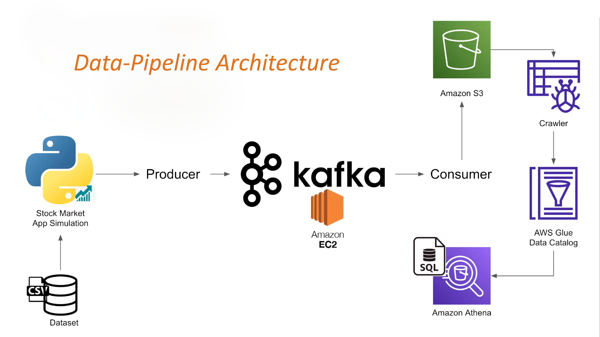

# Real-Time_Stock_Analytics_with_Kafka_and_AWS
<div id="top"></div>

## Short Description
Utilize Apache Kafka for real-time data ingestion of stock market information, enabling efficient data streaming. Integrate with AWS services such as Amazon S3 for storage, AWS Glue for data cataloging and ETL, and Amazon Athena for querying and analysis.

**Solution:** This ensures seamless processing and insightful analysis of stock market data, facilitating timely decision-making and data-driven strategies.

## Table of Contents
- [Architecture Diagram](#architecture-diagram)
- [How it works?](#how-it-works)
    - [Data-Scraping](#data-scraping)
    - [Data-Process](#data-process)
    - [Data-Access](#data-access)
- [Pre-requisites](#pre-requisites)
- [Running Project](#running-project)
    - [Kafka-Server-Console](#kafka-server-console)
    - [AWS-Services](#aws-services)
- [Contact](#contact)

### Architecture Diagram

<p align="right">(<a href="#top">Back to Top</a>)</p>

### How it works?
#### Data-Scraping:
- Set up a Kafka Topic where data will be published by producers.
- Implement a Kafka Producer that reads data from a local CSV file and writes it to the Kafka topic.
- Develop a Kafka Consumer that subscribes to the Kafka topic and reads the data.
- Configured the data ingestion process to occur every 2 seconds,
simulating real-time data streaming from the 'CSV' file with shape(104224, 10) to Kafka.

#### Data-Process:
- Set up AWS credentials with the "aws configure" command before running the Python script to ensure it can access AWS S3.
- Used `kafka-python` library to connect to Kafka and fetch data from the topic.
- Used `s3fs` library to upload records as 'JSON' format to the specified S3 bucket.

#### Data-Access:
- Create an IAM role for AWS Glue with `AdministratorAccess` and `AWSGlueConsoleFullAccess` policies attached.
- Set up and run AWS Glue Crawler to catalog data from your S3 bucket and populate the Data Catalog with its metadata.
- After crawling the data from S3 bucket, create an ETL job to transform the data and
save as 'PARQUET' format in the specified S3 bucket.
- Configure Amazon Athena to use the Glue Data Catalog and query results using standard SQL for analysis.
<p align="right">(<a href="#top">Back to Top</a>)</p>

### Pre-requisites
- Download Kafka: kafka_2.12-3.5.2.tgz
- Install Java: java-1.8.0-openjdk
- Install Python: python-3.8
- AWS Account [S3, Glue, Athena]
- Libraries used: s3fs, kafka-python
<p align="right">(<a href="#top">Back to Top</a>)</p>

### Running Project
**AWS-EC2 Machine Installation:**
- Create an AWS-account and launch the instance.
- Choose Linux-2, 64GB Storage, 4GB Memory.
- Need to create key-pair for aunthentication(.pem or .ppk).
- Edit the security inbound rules to allow all traffic and set the source to IPv4 anywhere.
- Use SSH to connect from your local machine to the EC2 instance. [Using any terminal emulator]

**Download Apache Kafka and extract the tar file:**
```bash
wget https://downloads.apache.org/kafka/3.5.2/kafka_2.12-3.5.2.tgz
tar -zxvf kafka_2.12-3.5.2.tgz
```

**Install Java-8:**
```bash
sudo yum install java-1.8.0-openjdk (For ubuntu = sudo apt-get install openjdk-8-jre)
java -version
```

**Start Zoo-keeper:**
```bash
cd kafka_2.12-3.5.2
bin/zookeeper-server-start.sh config/zookeeper.properties
```

**Start Kafka-server:**
Open a new console>
```bash
cd kafka_2.12-3.3.1
export KAFKA_HEAP_OPTS="-Xmx256M -Xms128M" ## Used to set JVM options for Kafka's heap memory.
```
Note: Change 'ADVERTISED_LISTENERS' property inside 'config/server.properties', so that it can run in Public-IP.
```bash
bin/kafka-server-start.sh config/server.properties
```

**Create the topic:**
Open a new console>
```bash
cd kafka_2.12-3.3.1
bin/kafka-topics.sh --create --topic kafkatest --bootstrap-server 54.159.21.31:9092 --replication-factor 1 --partitions 1
bin/kafka-broker-api-versions.sh --bootstrap-server 54.81.241.251:9092 # (optional)
```

**Start Producer:**
```bash
bin/kafka-console-producer.sh --topic kafkatest --bootstrap-server 54.159.21.31:9092
```

**Start Consumer:**
Open a new console>
```bash
cd kafka_2.12-3.3.1
bin/kafka-console-consumer.sh --topic kafkatest --bootstrap-server 54.159.21.31:9092
```

#### Kafka-Server-Console (Preview)

<p align="right">(<a href="#top">Back to Top</a>)</p>

#### AWS-Services

*S3 Bucket Configuration*
- Landing Zone: Used for data ingestion.
- Transfer Zone: Holds data after ETL jobs.
- Results Zone: Stores query results.

*AWS Glue(ETL) and Amazon Athena Setup*
- Configure and run the AWS Glue Crawler to catalog data from your S3 bucket.
- Develop an ETL job to transform the crawled data and save as 'Parquet' format in the specified S3 bucket.
- Set up Amazon Athena to perform queries on the data using standard SQL for analysis.

#### Buckets_Glue_Athena (Preview)

<p align="right">(<a href="#top">Back to Top</a>)</p>

### Contact
[][reach_linkedin]
[][reach_gmail]

<!-- Reach Contact -->
[reach_linkedin]: https://www.linkedin.com/in/narendran-mudadi/
[reach_gmail]: mailto:narendas10@gmail.com?subject=Github