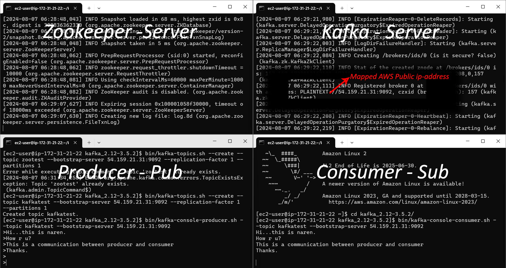

# Real-Time_Stock_Analytics_with_Kafka_and_AWS

## Short Description
Utilize Apache Kafka for real-time data ingestion of stock market information, enabling efficient data streaming. Integrate with AWS services such as Amazon S3 for storage, AWS Glue for data cataloging and ETL, and Amazon Athena for querying and analysis. This solution ensures seamless processing and insightful analysis of stock market data, facilitating timely decision-making and data-driven strategies.

## Table of Contents
- [Architecture Diagram](#architecture-diagram)
- [How it works?](#how-it-works)
    - [Kafka-Server-Console](#kafka-server-console)
- [Pre-requisites](#pre-requisites)
- [Running Project](#running-project)
- [Contact](#contact)

### Architecture Diagram


### How it works?
**AWS-EC2 Machine Installation:**
- Create an AWS-account and launch the instance.
- Choose Linux-2, 64GB Storage, 4GB Memory.
- Need to create key-pair for aunthentication(.pem or .ppk).
- Edit the security inbound rules to allow all traffic and set the source to IPv4 anywhere.
- Use SSH to connect from your local machine to the EC2 instance. [Using any terminal emulator]

**Download Apache Kafka and extract the tar file:**
```bash
wget https://downloads.apache.org/kafka/3.5.2/kafka_2.12-3.5.2.tgz
tar -zxvf kafka_2.12-3.5.2.tgz
```

**Install Java-8:**
```bash
sudo yum install java-1.8.0-openjdk (For ubuntu = sudo apt-get install openjdk-8-jre)
java -version
```

**Start Zoo-keeper:**
```bash
cd kafka_2.12-3.5.2
bin/zookeeper-server-start.sh config/zookeeper.properties
```

**Start Kafka-server:**
Open a new console. --
```bash
cd kafka_2.12-3.3.1
export KAFKA_HEAP_OPTS="-Xmx256M -Xms128M" ## Used to set JVM options for Kafka's heap memory.
```
Note: Change 'ADVERTISED_LISTENERS' property inside 'config/server.properties' so that it can run in Public-IP.
```bash
bin/kafka-server-start.sh config/server.properties
```

**Create the topic:**
Open a new console. --
```bash
cd kafka_2.12-3.3.1
bin/kafka-topics.sh --create --topic kafkatest --bootstrap-server 54.159.21.31:9092 --replication-factor 1 --partitions 1
bin/kafka-broker-api-versions.sh --bootstrap-server 54.81.241.251:9092 # (optional)
```

**Start Producer:**
```bash
bin/kafka-console-producer.sh --topic kafkatest --bootstrap-server 54.159.21.31:9092
```

**Start Consumer:**
Open a new console. --
```bash
cd kafka_2.12-3.3.1
bin/kafka-console-consumer.sh --topic kafkatest --bootstrap-server 54.159.21.31:9092
```

### Kafka-Server-Console
